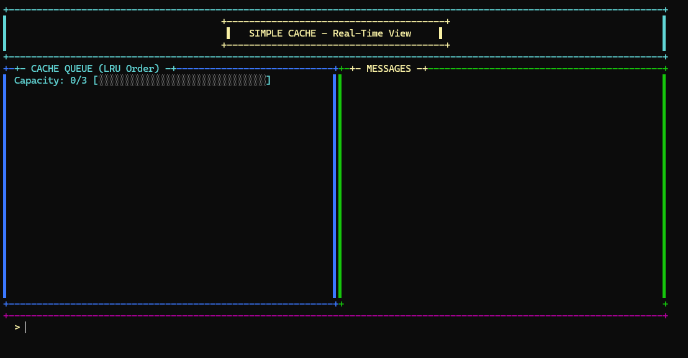
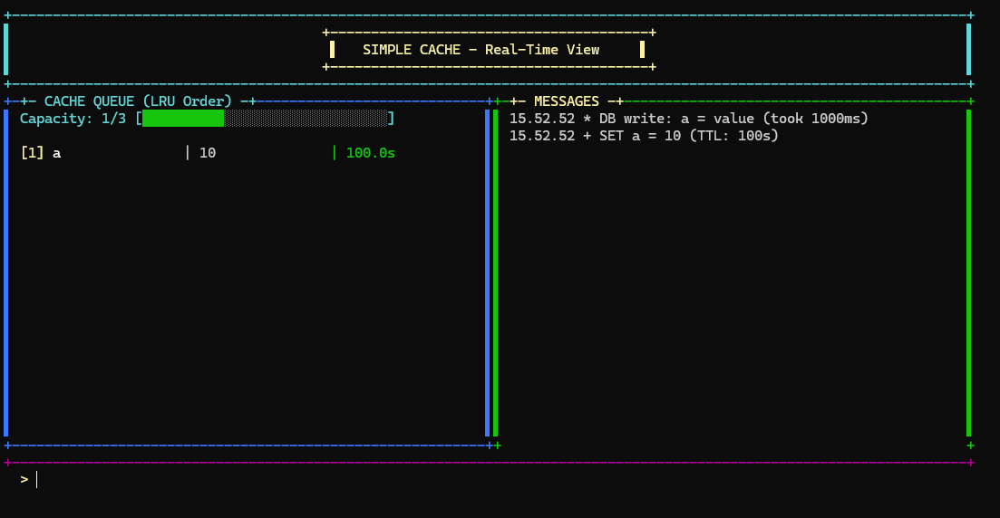
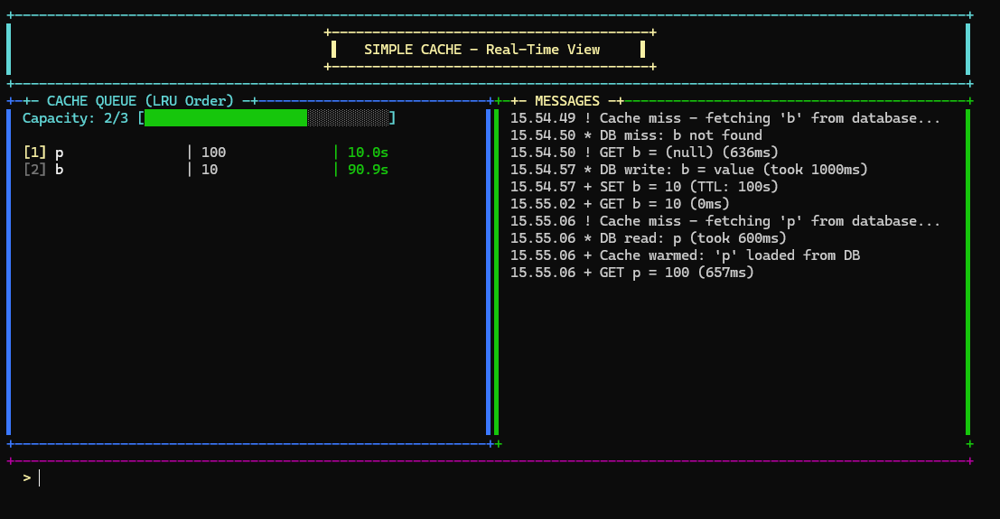
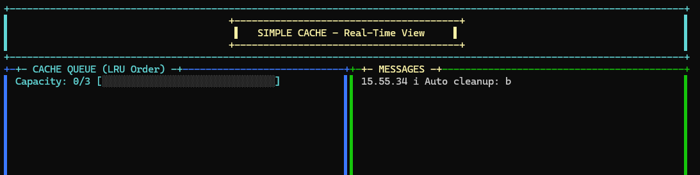
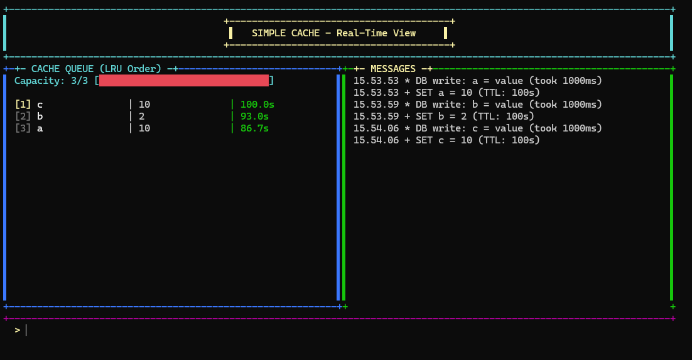
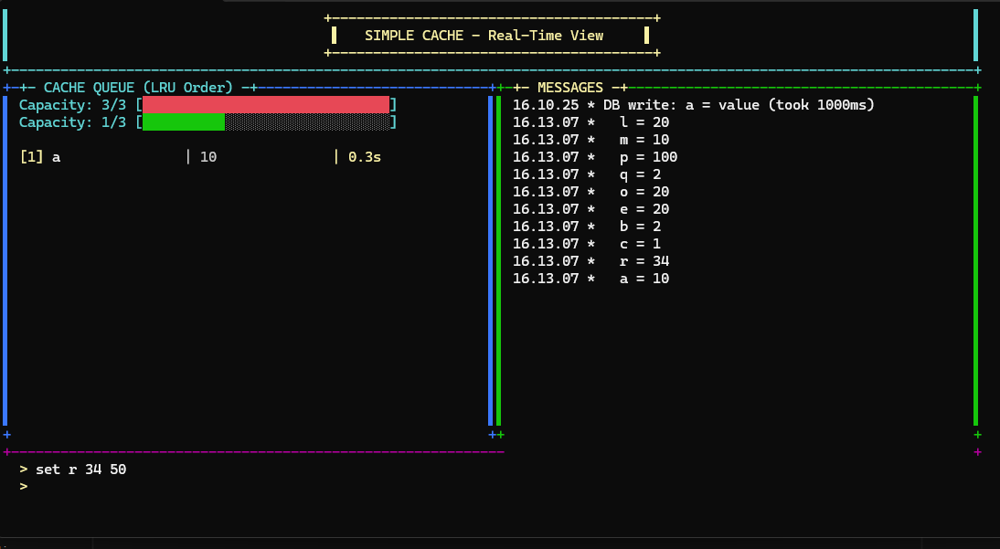

# 🚀 Single Node Cache System

<div align="center">


**A high-performance, real-time LRU cache implementation with TTL support and database persistence**

[Features](#-features) • [Getting Started](#-getting-started) • [Commands](#-commands) • [Architecture](#-architecture)

</div>

---

## 📋 Table of Contents

- [Overview](#-overview)
- [Features](#-features)
- [Screenshots](#-screenshots)
- [Architecture](#-architecture)
- [Technologies](#-technologies)
- [Getting Started](#-getting-started)
- [Commands](#-commands)
- [How It Works](#-how-it-works)
- [Project Structure](#-project-structure)
- [Contributing](#-contributing)
- [License](#-license)

---

## 🎯 Overview

**Single Node Cache** is a feature-rich, production-ready caching system built with C# and .NET 10. It combines the speed of in-memory caching with the reliability of database persistence, providing a complete solution for high-performance data access.

The system features a beautiful real-time CLI interface that visualizes cache operations, making it perfect for learning cache concepts or building production-ready applications.

### 🌟 Key Highlights

- ⚡ **Lightning Fast**: In-memory cache with ~2ms response time
- 💾 **Persistent**: File-based database simulation with realistic delays
- 🔄 **LRU Eviction**: Automatic least-recently-used item removal
- ⏰ **TTL Support**: Time-to-live expiration for cache entries
- 🧹 **Auto Cleanup**: Background service removes expired items every 5 seconds
- 🎨 **Real-time UI**: Beautiful console interface with live updates
- 📊 **Full Observability**: Complete event tracking and logging

---

## ✨ Features

### 🚀 Core Features

| Feature | Description |
|---------|-------------|
| **LRU Cache** | Least Recently Used eviction policy with configurable capacity |
| **TTL Expiration** | Optional time-to-live for cache entries |
| **Database Persistence** | File-based storage with simulated read/write delays |
| **Write-Through Cache** | Automatic synchronization between cache and database |
| **Read-Through Cache** | Automatic cache warming on cache miss |
| **Auto Cleanup** | Background service removes expired entries every 5 seconds |
| **Thread-Safe** | Uses `ReaderWriterLockSlim` for concurrent access |
| **Event-Driven** | Complete event system for all cache operations |

### 🎨 UI Features

- 📊 **Real-time Cache Visualization**: See cache state update instantly
- 📈 **Capacity Bar**: Visual representation of cache usage
- 💬 **Message Panel**: Timestamped logs of all operations
- 🎯 **LRU Ordering**: Items displayed in LRU order with position indicators
- ⏱️ **TTL Countdown**: Live countdown for expiring items
- 🌈 **Color Coding**: Different colors for different states (active/expired/warning)

---

## 📸 Screenshots

### Main Interface

*Real-time cache visualization with LRU ordering, TTL countdown, and message logging*

### Cache Operations

*SET, GET, and DELETE operations with performance metrics*

### Cache Miss & Database Read

*Cache miss scenario showing database read with delay simulation and cache warming*

### Auto Cleanup

*Background cleanup service removing expired items automatically*

### LRU Eviction

*Least Recently Used item eviction when cache reaches capacity*

### Database List

*View all items stored in the database file*

---

## 🏗️ Architecture

### System Design

```
┌─────────────────────────────────────────────────────────┐
│                     CLI Layer (UI)                       │
│  ┌──────────────────────────────────────────────────┐  │
│  │          CacheConsole (Real-time UI)              │  │
│  │  • Event Subscriptions                            │  │
│  │  • Message Display                                │  │
│  │  • Cache Visualization                            │  │
│  └──────────────────────────────────────────────────┘  │
└─────────────────────────────────────────────────────────┘
                          ↕ Events
┌─────────────────────────────────────────────────────────┐
│                   Service Layer                          │
│  ┌──────────────────────────────────────────────────┐  │
│  │              CacheManager                         │  │
│  │  • Write-Through Strategy                         │  │
│  │  • Read-Through Strategy                          │  │
│  │  • Cache Warming                                  │  │
│  └──────────────────────────────────────────────────┘  │
└─────────────────────────────────────────────────────────┘
           ↕                              ↕
┌──────────────────────┐      ┌──────────────────────────┐
│    Core Layer        │      │   Services Layer         │
│  ┌────────────────┐  │      │  ┌────────────────────┐  │
│  │  SimpleCache   │  │      │  │  FileDatabase      │  │
│  │  • LRU List    │  │      │  │  • Read/Write      │  │
│  │  • Dictionary  │  │      │  │  • Delay Simulation│  │
│  │  • TTL Support │  │      │  │  • Thread Safety   │  │
│  └────────────────┘  │      │  └────────────────────┘  │
│  ┌────────────────┐  │      │  ┌────────────────────┐  │
│  │ CleanupService │  │      │  │     db.txt         │  │
│  │  • Auto Expire │  │      │  │  • Persistent      │  │
│  └────────────────┘  │      │  │    Storage         │  │
└──────────────────────┘      │  └────────────────────┘  │
                              └──────────────────────────┘
```

### Event Flow

```
User Command (SET/GET/DEL)
    ↓
CacheManager (Coordination)
    ↓
┌───────────────────┬────────────────────┐
↓                   ↓                    ↓
SimpleCache      FileDatabase      CleanupService
(In-Memory)      (Persistent)      (Background)
    ↓                   ↓                    ↓
Events Fired    Events Fired        Events Fired
    ↓                   ↓                    ↓
    └───────────────────┴────────────────────┘
                        ↓
              CacheConsole (UI Update)
                        ↓
              AddMessage (Display)
```

---

## 🛠️ Technologies

- **Language**: C# 14.0
- **Framework**: .NET 10.0
- **Architecture**: Event-Driven, Layered Architecture
- **Concurrency**: `ReaderWriterLockSlim` for thread-safe operations
- **Storage**: File-based persistence (simulated database)
- **UI**: Console-based with real-time updates

### Key Design Patterns

- ✅ **Event-Driven Architecture**: Loose coupling via events
- ✅ **Write-Through Cache**: Ensures data consistency
- ✅ **Read-Through Cache**: Automatic cache warming
- ✅ **Observer Pattern**: UI updates on cache changes
- ✅ **Singleton Pattern**: CleanupService instance
- ✅ **Repository Pattern**: Database abstraction

---

## 🚀 Getting Started

### Prerequisites

- [.NET 10.0 SDK](https://dotnet.microsoft.com/download/dotnet/10.0) or later
- Windows, macOS, or Linux
- Terminal with Unicode support (for best UI experience)

### Installation

1. **Clone the repository**
   ```bash
   git clone https://github.com/Prashanth-000/Single-Node-LRU-Cache
   cd Single-Node-Cache
   ```

2. **Build the project**
   ```bash
   dotnet build
   ```

3. **Run the application**
   ```bash
   dotnet run
   ```

### Configuration

Edit `Program.cs` to customize:

```csharp
// Cache capacity (number of items)
var cache = new SimpleCache(3);  // Default: 3 items

// Database delays (milliseconds)
var database = new FileDatabase(
    dbFilePath, 
    readDelayMs: 600,   // Read delay
    writeDelayMs: 1000  // Write delay
);
```

---

## 📝 Commands

### Available Commands

| Command | Syntax | Description | Example |
|---------|--------|-------------|---------|
| **SET** | `SET <key> <value> [ttl]` | Store key-value pair with optional TTL (seconds) | `SET user1 John 30` |
| **GET** | `GET <key>` | Retrieve value by key (shows timing) | `GET user1` |
| **EX** | `EX <key>` | Check expiry time for a key | `EX user1` |
| **DEL** | `DEL <key>` | Delete key from cache and database | `DEL user1` |
| **DBLIST** | `DBLIST` | List all items in database | `DBLIST` |
| **CLEAR** | `CLEAR` | Clear message panel | `CLEAR` |
| **EXIT** | `EXIT` | Exit application | `EXIT` |

### Usage Examples

#### Basic Operations
```bash
# Store data without TTL
> SET product_1 Laptop
SET product_1 = Laptop (No TTL)
DB write: product_1 = value (took 1000ms)

# Store data with 60 second TTL
> SET session_x active 60
SET session_x = active (TTL: 60s)
DB write: session_x = value (took 1000ms)

# Retrieve data (cache hit - fast)
> GET product_1
GET product_1 = Laptop (2ms)

# Retrieve data (cache miss - slow)
> GET product_2
Cache miss - fetching 'product_2' from database...
DB read: product_2 (took 600ms)
Cache warmed: 'product_2' loaded from DB
GET product_2 = Mouse (605ms)
```

#### Advanced Operations
```bash
# Check expiry time
> EX session_x
EX session_x - Expires in 45.3s (at 15:30:45)

# Delete item
> DEL product_1
DEL product_1 - Deleted from database
DB delete: product_1 (took 1000ms)

# List database contents
> DBLIST
Database contains 3 items:
  user1 = John
  product_2 = Mouse
  session_x = active
```

---

## ⚙️ How It Works

### 1️⃣ Write-Through Caching (SET)

```
User: SET user1 John 30
    ↓
1. Write to Database (1000ms delay) ─────┐
2. Write to Cache                         │
3. Fire ItemSet Event                     │
4. Update UI                              │
    ↓                                     ↓
Cache: [user1=John, TTL:30s]    DB: user1=John
```

### 2️⃣ Read-Through Caching (GET)

**Cache Hit (Fast Path)**
```
User: GET user1
    ↓
Check Cache ──→ Found! ──→ Return (2ms)
    ↓
Fire CacheHit Event
    ↓
Update UI
```

**Cache Miss (Slow Path)**
```
User: GET user2
    ↓
Check Cache ──→ Not Found!
    ↓
Fire CacheMiss Event
    ↓
Read from Database (600ms delay)
    ↓
Fire DatabaseRead Event
    ↓
Warm Cache ──→ Store in cache
    ↓
Fire CacheWarmed Event
    ↓
Return (605ms total)
```

### 3️⃣ LRU Eviction

```
Cache Full (3/3):
[user1] [user2] [user3]
  ↑MRU            ↑LRU

User: SET user4 NewValue
    ↓
Evict LRU (user3) ──→ Fire ItemEvicted Event
    ↓
Cache (3/3):
[user4] [user1] [user2]
  ↑MRU            ↑LRU
```

### 4️⃣ Auto Cleanup

```
CleanupService (runs every 5 seconds)
    ↓
Check all items for expiration
    ↓
┌──────────┬──────────┬──────────┐
│ user1    │ user2    │ session  │
│ TTL: 30s │ No TTL   │ EXPIRED! │
└──────────┴──────────┴──────────┘
                            ↓
                    Remove expired item
                            ↓
                  Fire ItemCleaned Event
                            ↓
                      Update UI
```

---

## 📁 Project Structure

```
Single_Node_Cache/
│
├── 📂 CLI/
│   └── CacheConsole.cs          # Real-time UI, event handling
│
├── 📂 Core/
│   ├── CacheItem.cs             # Cache entry with TTL
│   └── SimpleCache.cs           # LRU cache implementation
│
├── 📂 Services/
│   ├── CacheManager.cs          # Coordination layer
│   ├── CleanupService.cs        # Background cleanup
│   ├── FileDatabase.cs          # File-based persistence
│   └── db.txt                   # Database file
│
├── 📂 Result_img/               # Screenshots
│   ├── main_interface.png
│   ├── cache_operations.png
│   ├── cache_miss.png
│   ├── auto_cleanup.png
│   ├── lru_eviction.png
│   └── database_list.png
│
├── Program.cs                   # Entry point
├── README.md                    # This file
└── Single_Node_Cache.csproj     # Project file
```

---

## 🎨 UI Components

### Cache Panel (Left)
- **Capacity Bar**: Visual `[████░░░]` representation
- **Item List**: Shows key, value, TTL in LRU order
- **Color Coding**:
  - 🟡 Yellow: Most recently used
  - ⚪ White: Active items
  - 🔴 Red: Expired items
  - 🟢 Green: TTL > 5 seconds
  - 🟡 Yellow: TTL < 5 seconds

### Message Panel (Right)
- **Timestamped Logs**: `HH:mm:ss` format
- **Icon Indicators**:
  - `+` Green: Success
  - `X` Red: Error
  - `!` Yellow: Warning
  - `i` Cyan: Info
  - `*` Default

### Command Panel (Bottom)
- **Clean Input Area**: Always visible prompt
- **Cursor Protection**: Stays in place during updates

---

## 📊 Performance Metrics

| Operation | Cache Hit | Cache Miss (DB Read) |
|-----------|-----------|----------------------|
| **GET** | ~2ms | ~605ms |
| **SET** | N/A | ~1000ms (DB write) |
| **DEL** | ~1ms | ~1000ms (DB delete) |

### Cache Statistics

- **Capacity**: Configurable (default: 3 items)
- **Eviction**: LRU (Least Recently Used)
- **Cleanup Interval**: 5 seconds
- **Thread Safety**: `ReaderWriterLockSlim`
- **Event Overhead**: < 1ms

---

## 🔧 Customization

### Change Cache Capacity

```csharp
// In Program.cs
var cache = new SimpleCache(10);  // Increase to 10 items
```

### Adjust Database Delays

```csharp
// In Program.cs
var database = new FileDatabase(
    dbFilePath, 
    readDelayMs: 100,   // Faster reads
    writeDelayMs: 200   // Faster writes
);
```

### Modify Cleanup Interval

```csharp
// In Services/CleanupService.cs
private readonly Timer _timer = new Timer(
    CleanupCallback, 
    null, 
    TimeSpan.FromSeconds(10),  // Change to 10 seconds
    TimeSpan.FromSeconds(10)
);
```

---

## 🐛 Troubleshooting

### UI Not Displaying Correctly
- Ensure your terminal supports Unicode characters
- Resize terminal to at least 120x40 characters
- On Windows, use Windows Terminal or PowerShell Core

### Database File Locked
- Close any other applications accessing `Services/db.txt`
- Check file permissions

### Performance Issues
- Reduce database delay times
- Increase cache capacity
- Adjust cleanup interval

---

## 🤝 Contributing

Contributions are welcome! Here's how you can help:

1. 🍴 Fork the repository
2. 🌿 Create a feature branch (`git checkout -b feature/AmazingFeature`)
3. 💾 Commit your changes (`git commit -m 'Add some AmazingFeature'`)
4. 📤 Push to the branch (`git push origin feature/AmazingFeature`)
5. 🔃 Open a Pull Request

### Ideas for Contributions

- 🔌 Redis-compatible protocol support
- 📊 Metrics and monitoring dashboard
- 🌐 REST API interface
- 🔍 Query language for cache entries
- 💾 Multiple storage backends (SQLite, PostgreSQL)
- 🔐 Authentication and authorization
- 📈 Performance benchmarking tools
- 🧪 Additional unit tests

---

## 📄 License

This project is licensed under the MIT License - see the [LICENSE](LICENSE) file for details.

---

## 🙏 Acknowledgments

- Built with ❤️ using C# and .NET 10
- Inspired by Redis, Memcached, and LRU cache implementations
- Special thanks to the .NET community

---

## 📞 Contact

- **Issues**: [GitHub Issues](https://github.com/Prashanth-000/Single-Node-LRU-Cache/issues)
- **Discussions**: [GitHub Discussions](https://github.com/Prashanth-000/Single-Node-LRU-Cache)

---

<div align="center">

**⭐ Star this repository if you find it helpful!**

Made with 💻 and ☕

</div>
